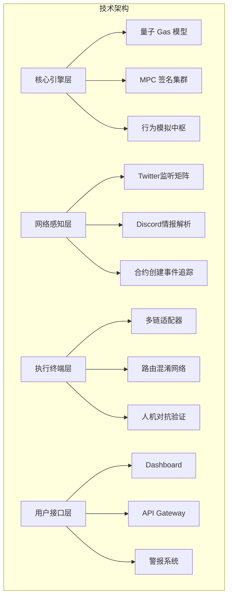
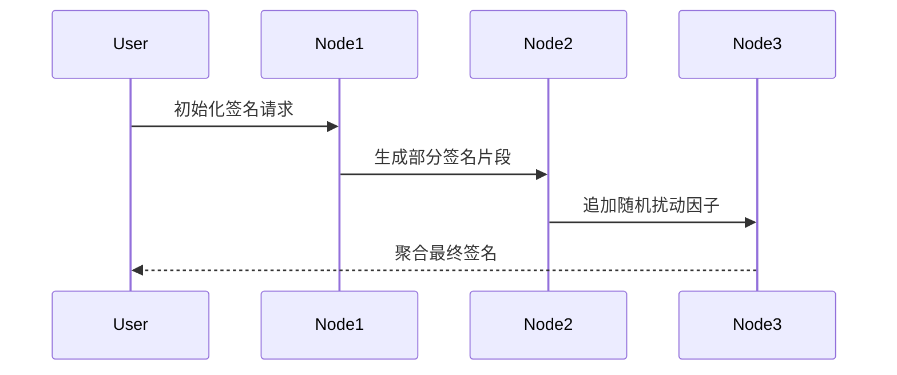

# NeuBot

全维度链上测试网自动化系统

## 整体架构

## 功能模块分解

### 网络感知层 (Network Intelligence Layer)

#### Twitter 实时监控系统

| 子模块名称                    | 描述             | 技术实现                                      |
| ----------------------------- | ---------------- | --------------------------------------------- |
| Tweet Filter                  | 关键词抓取与分类 | 正则表达式+深度学习文本分类模型 （BERT 微调） |
| Account Credibility Validator | 账号可信度评估   | 基于 PageRank 算法构建账号影响力评分系统      |
| Link Extractor                | 智能合约地址提取 | 以太坊地址匹配模式 + 测试网验证机制           |

- 数据采集引擎

- 文本特征提取系统

- 地址嗅探核心算法

- 对抗检测机制

- 链环境适配器 (Chain Adapter)

- 核心执行引擎 (Execution Engine)

- TSS

- 路由混淆网络 (Obfuscation Router)

### 审计与防御体系

| 审计维度     | 防御技术                         | 实现位置              |
| ------------ | -------------------------------- | --------------------- |
| 地址关联分析 | MPC 门限签名 + 资金闭环循环      | TSS 签名集群          |
| 交易模式识别 | 基于 GAN 的伪造交易序列生成      | NeuBotGAN 模块        |
| Gas 模式指纹 | GARCH 波动模型 + 量子扰动注入    | QuantumGasEngine      |
| IP 设备追踪  | 分布式 Tor 中继 + 硬件指纹模拟器 | DarkNetworkMiddleware |
| 合约交互特征 | 动态路由选择 + 死代码注入        | PathObfuscatorV2      |
